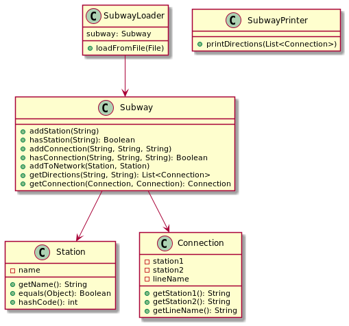

# Objectville Route Finder

Objectville Route Finder is the problem proposed to solve in chapter 10 of book [Head First Object-Oriented Analysis and Design](https://www.oreilly.com/library/view/head-first-object-oriented/0596008678/). The original version [was implemented in Java](https://resources.oreilly.com/examples/9780596008673) and this project is a Kotlin version compatible with JVM 11.

# Description

Basically, the system to develop must be able to load a file with a set of stations, lines and connections of a subway and calculate a route to go between stations. Also, the system has to let travel agents to print out a route indicating which lines to take and if the travellers have to change to another station in a connection line.

# Feature list

This is the list of features that the solution cover:

- Should be able to store complete network of subways lines and stations along each lines.
- Should be able to figure out the route between a starting and destination station.
- Should be able to print out the route indicating which lines to take, which stations are passed on a line and when the travelers have to get off a line and get on another.

# Use cases

The actors and the use cases are the following:

# Requirements

The necessary steps to implement each use case are:

## Load Network of subway

1. Load the file with stations and lines.
2. Read every station and add to the subway.
3. Read every line and add connections between stations

Validate each operation before adding to the subway is needed to ensure that the system is working properly.

## Get Directions

1. Enter a starting, and a destination station
2. Calculate the route between stations
3. Print out the route

# Design

# Test cases

To run the test cases:

`$ ./gradlew test`

# Usage

To run the application only execute this command with gradle:

`$ ./gradlew run`